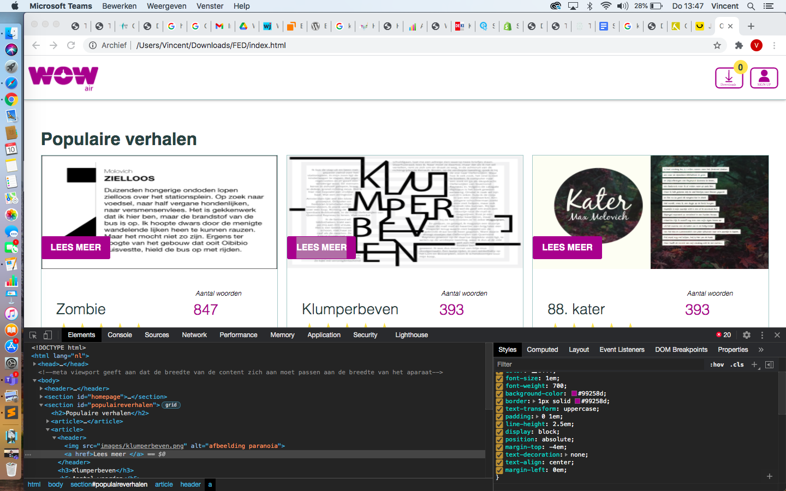
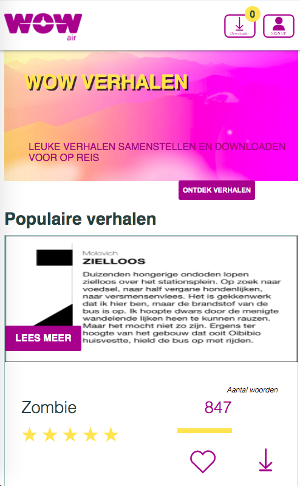
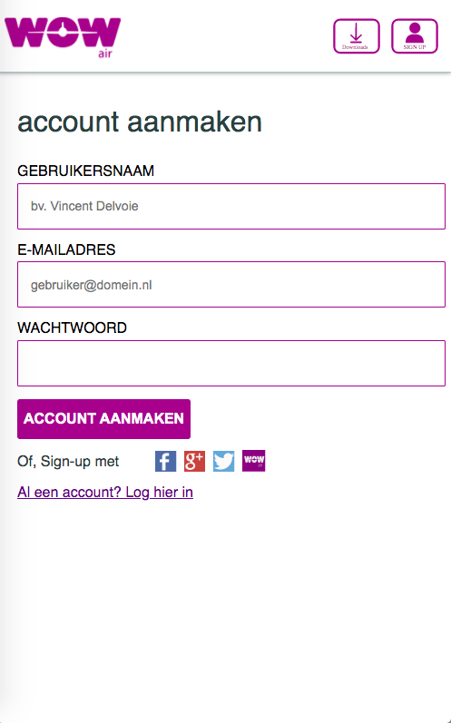

# Procesverslag
**Auteur:** Vincent Delvoie
**Studentnummer** 500665883
**Vak** Front End
**Docent** Danny de Vries
**Datum** 11/01/2020

## Bronnenlijst
1. https://www.w3schools.com/
2. https://www.codecademy.com/
3. https://www.codepe.io/
4. https://css-tricks.com/snippets/css/a-guide-to-flexbox/
5. https://css-tricks.com/snippets/css/complete-guide-grid/
6. https://www.w3schools.com/js/js_loop_for.asp
7. https://www.w3schools.com/js/js_this.asp
8. https://www.w3schools.com/css/css3_animations.asp
9. https://www.w3schools.com/css/css3_transitions.asp
10. https://www.w3schools.com/graphics/svg_inhtml.asp

## Eindgesprek (week 7/8)

Code en website ziet er goed uit volgens docent. Toelichting had beter gekund, met name bij Javascript. Readme file te karig, hiervoor is een aanvulling nodig. Een screenshot van de code gemaakt zodat ik dit later kan aanpassen.

**Screenshot(s):**

## Voortgang 3 (week 6)

CSS element element met Guus besproken. Hij gaf aan dat de "lees meer-knop" niet goed reageerde omdat er een marging-left op zat wat er voor zorgde dat het responsive niet goed meebewoog. Transitie toegevoegd aan pop-up met behulp van https://www.w3schools.com/css/css3_transitions.asp. 

## Voortgang 2 (week 5)

Opdracht opnieuw begonnen, maar toch teruggevallen op oude opdracht in verband met tijdnood. Dit in overleg met docent gedaan en naar de website gekeken. Feedback: vrij compleet al, mist nog javascript en komt nog niet door de validator heen.

## Voortgang 1 (week 3)

Opdracht van vorig jaar laten zien. Hierna besloten om toch opnieuw te beginnen met een nieuwe website. Hiervoor was een opzet gemaakt om de website van superdry.com na te maken. 

### Stand van zaken

Oude opdracht van vorig jaar laten zien. Al vrij compleet. Mist alleen nog Javascript en code moet goed door de validator heen komen. 

### Agenda voor meeting

10/12/2020 Guus (Studentassistent)

vragen:

- Samen door de CSS en structuur van de website gaan
- Sommige elementen reageerden raar, dus dit samen met Guus nagekeken. Zie code line 371.

### Verslag van meeting

Alleen een tussentijdse meeting met Guus (studentassistent) gehad op 10/12/2020. Met Guus door de structuur van de website gegaan en met name CSS nagekeken. Daarnaast gaf hij tips over de mogelijkheden met Javascript. 

## Breakdownschets (week 1)

- Niet gemaakt. Opdracht van vorig jaar laten zien. 

## Intake (week 1)
-uitwerken voor de kick-off werkgroep - begin van de eerste week-

**Je startniveau:** blauw

**Je focus:** responsive

**Je opdracht:** -link naar de website die je gaat namaken óf de naam van je eigen ontwerp-

**Screenshot(s) van de eerste pagina (small screen):**

**Screenshot(s) van de tweede pagina (small screen):**

